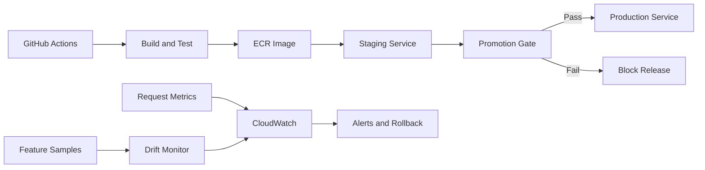

# AWS MLOps Reference Platform

A cloud-native reference platform for promoting machine-learning releases through automated quality, drift, and operational gates before production deployment on AWS.

## Business problem

Shipping a model is not the same as operating one. Teams need reproducible releases, measurable promotion criteria, rollback paths, observability, and protection against data drift. This project demonstrates those controls without coupling the platform to one model framework.

## Reference architecture



## What is implemented

- Immutable model-release metadata and semantic versions
- Promotion gates for accuracy, latency, error rate, and drift
- Population Stability Index drift calculation
- FastAPI prediction and release-readiness endpoints
- Health checks suitable for load balancers and container orchestration
- Docker packaging and local composition
- AWS CloudFormation for ECR, SQS/DLQ, logs, alarms, and artifact storage
- Unit tests and GitHub Actions CI

## Run locally

```bash
python -m venv .venv
pip install -r requirements.txt
uvicorn app:app --reload
```

Run the platform tests:

```bash
python -m unittest -v test_platform.py
```

Evaluate a candidate release:

```json
{
  "version": "2.3.0",
  "accuracy": 0.94,
  "p95_latency_ms": 165,
  "error_rate": 0.006,
  "drift_psi": 0.08
}
```

## Production evolution

- Deploy the service on ECS/Fargate, EKS, or SageMaker endpoints
- Store release metadata in DynamoDB and artifacts in versioned S3
- Use weighted target groups for canary promotion
- Export OpenTelemetry traces and model-specific business metrics
- Integrate Feature Store, MLflow, or SageMaker Model Registry
- Add automatic rollback through CloudWatch alarms and deployment hooks

## Repository boundaries

This repository is a synthetic architecture demonstration. It does not contain client models, proprietary datasets, cloud credentials, or production infrastructure identifiers.

## License

MIT
